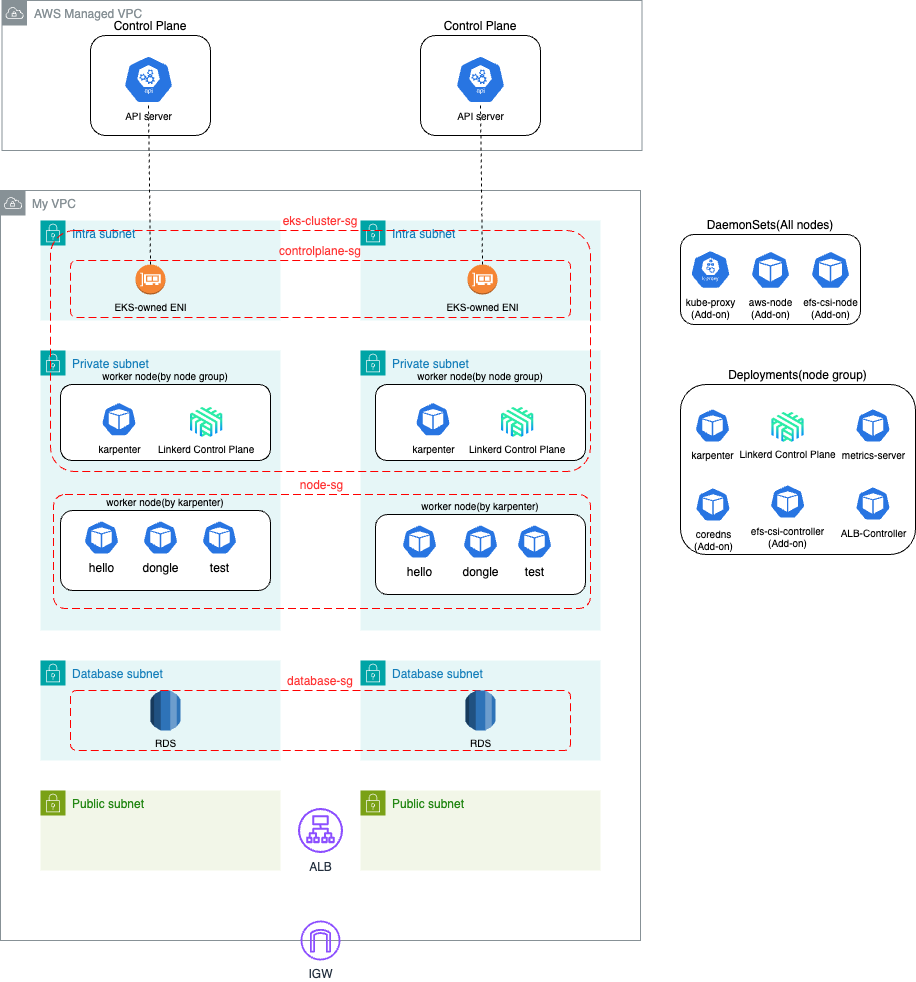

# Terraform
- [Overview](#overview)
- [Architecture](#architecture)
- [References](#references)
    - [The latest news](#the-latest-news)
    - [VPC and Subnets](#vpc-and-subnets)
    - [Security groups](#security-groups)
    - [Karpenter](#karpenter)
    - [Additional commands](#additional-commands)


## Overview

EKS Karpenter, Linkerd(service mesh)를 중심으로 하는 Terraform 프로젝트
- 복잡한 AWS community 모듈이 아닌, 필요한 기능을 작성하여 사용성을 높임
- 모듈 개발로 EKS Karpenter의 구조를 이해하고 인프라를 구축
- Karpenter는 v0.32.0 부터 [beta로 전환](https://aws.amazon.com/ko/blogs/containers/karpenter-graduates-to-beta/)

**AWS modules**
- vpc
- eks
    - karpenter, linkerd, aws-load-balancer-controller
- rds
- efs

**Environtments**

Tools
- terraform v1.6.2
- helm v3.13.1
- kubectl v1.28.2
- linkerd 2.14.4

Infra
- kubernetes 1.28
- karpenter v0.32.1
- aws load balancer controller 1.6.2

## Architecture

**서브넷 구성**
- Intra
    - 여러 AZ에 교차 계정 ENI 생성됨 (AWS 영역의 Control Plane과 사용자 VPC의 네트워크 통신을 위해)
    - EKS cluster 생성 시, 사용되는 subnet
- Private
    - nodes(by node group) -> 주요 파드(karpenter...)가 생성됨 (다이어그램 Deployments 참고)
    - nodes(by karpenter)
- Database
- public

<br>

**보안 그룹**
- `coredns` 53
- `API server` 443
- `Kubelet` 10250

| Security Group    | Inbound rules  | Source          |
| :---------------- | :------------- | --------------- |
| `eks-cluster-sg`  | 53/TCP, 53/UDP | node-sg         |
| ...               | All            | eks-cluster-sg  |
| `controlplane-sg` | 443            | node-sg         |
| `node-sg`         | 10250          | controlplane-sg |
| ...               | 1025 ~ 65535   | node-sg         |
|                   |                |                 |





## References

### The latest news

- EKS https://aws.amazon.com/ko/about-aws/whats-new/2023/10/amazon-eks-modification-cluster-subnets-security/
- Karpetner https://aws.amazon.com/ko/blogs/containers/karpenter-graduates-to-beta/


### VPC and Subnets
- https://github.com/terraform-aws-modules/terraform-aws-vpc#private-versus-intra-subnets
- https://docs.aws.amazon.com/eks/latest/userguide/network_reqs.html#network-requirements-subnets


### Security groups
- https://aws.github.io/aws-eks-best-practices/security/docs/network/#security-groups
- https://docs.aws.amazon.com/eks/latest/userguide/sec-group-reqs.html


### Karpenter
- https://aws.github.io/aws-eks-best-practices/karpenter/
- https://aws.github.io/aws-eks-best-practices/reliability/docs/application/#recommendations
- https://karpenter.sh/preview/concepts/disruption/#interruption


### Additional commands
```bash
# Add-on configuration
aws eks describe-addon-configuration --addon-name aws-efs-csi-driver --addon-version v1.7.0-eksbuild.1 --query 'configurationSchema' --output text | jq .

# Change the Log level of terraform 
export TF_LOG=DEBUG # INFO DEBUG

# Configure kube config to access kubernetes api server using cli
aws eks --region ap-northeast-2 update-kubeconfig --name hello

# Linkerd
linkerd check

```
